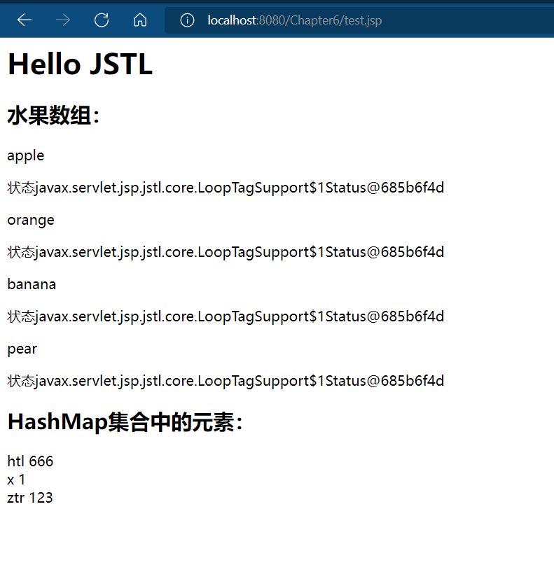
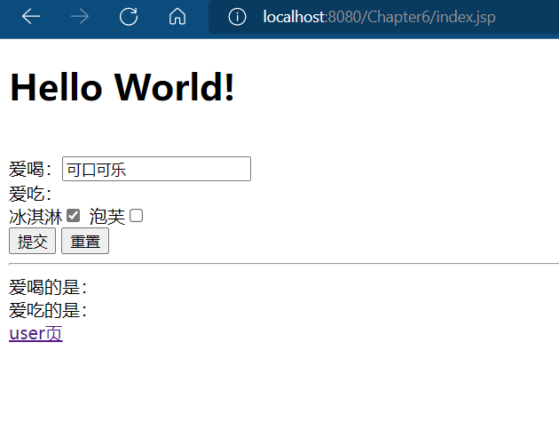
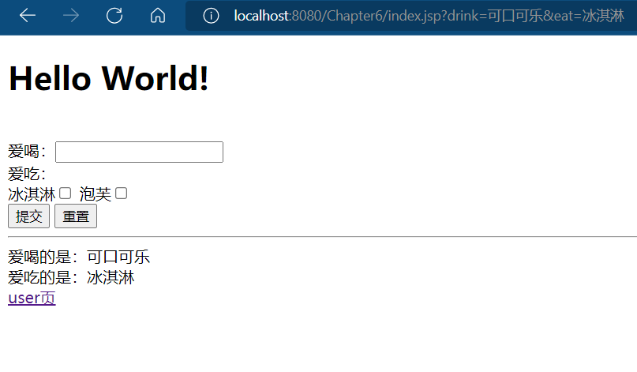
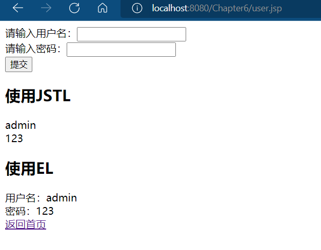

# 实验六
要求：
- 任务1、在JSP页面中放置一个文本框和一个的复选框，表单处理页面通过EL获取表单信息。
- 任务2、编写一个JavaBean命名为User，其中有两个属性：姓名和密码。在user.jsp页面中使用JSTL核心标签对JavaBean对象的属性赋值，然后分别使用JSTL核心标签和EL表达式获取输出JavaBean的属性。
- 任务3、编写网页，使用`<c:forEach>`标签分别作迭代特定次数和迭代对象集合内容的实验。尽可能地使用到该标签的各个属性。

## 掌握JavaBean和jstl的使用  
创建JavaBean,通过Servlet容器调用ServletRequest接口，传参给JavaBean，并保存数据Session中，在jsp页面中通过jstl或el调用。
## 效果截图

